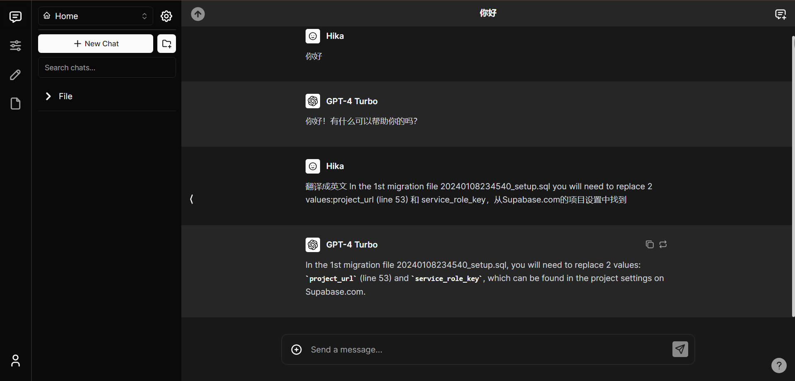

# Chatbot UI

The open-source AI chat app for everyone.



## Website

View the latest web [here](https://apiskey.com/).

## How to Use on apiskey.com

Sign up by filling in your email and password. You will receive an email in your inbox; click on the link provided. It's possible that you won't receive a confirmation of successful registration, but this is normal.
Then, return to the Apiskey login page and sign in. The web can upload and parse PDF files, but please note that filenames with Chinese characters may cause issues.

## Official Hosted Version

Check back soon for an official hosted version of Chatbot UI.

## Support

## Vercel Quickstart

### 1. Fork the repo

https://github.com/apiskeyc/chatbot-ui

### 2. Creat New Project On Vercel


### 3. Analytics and Build & Development Settings

In the "Analytics" section enable Web Analytics

In the "Settings" section, navigate to the "Build & Development Settings" page. Look for the "Install Command" option. Override it with 

Production Overrides

```bash
npm install
```

Project Settings Overrides

```bash
npm install @vercel/analytics
```

### 4. Integrations Supabase With Vercel

On the "Settings" page, navigate to the "Integrations" section to integrate Supabase into your project.

### 5. Supabase.com Setting。

After creating an account and a new project, go to the project settings (on Supabase.com)and click on "SQL Editor."

Enter and run the SQL query statements from the files in the `\chatbot-ui\supabase\migrations` directory sequentially into the command line within the SQL Editor.

In the 1st migration file 20240108234540_setup.sql, you will need to replace 2 values: `project_url` (line 53) and `service_role_key`(line 54), which can be found in the project settings on Supabase.com.

```bash
20240108234540_setup.sql
20240108234541_add_profiles.sql
20240108234542_add_workspaces.sql
20240108234543_add_folders.sql
20240108234544_add_files.sql
20240108234545_add_file_items.sql
20240108234546_add_presets.sql
20240108234547_add_assistants.sql
20240108234548_add_chats.sql
20240108234549_add_messages.sql
20240108234550_add_prompts.sql
20240108234551_add_collections.sql
```

For example, copy and paste the SQL queries into the SQL Editor and run them.

```sql
-- Enable HTTP extension
create extension http with schema extensions;

-- Enable vector extension
create extension vector with schema extensions;

-- Function to update modified column
CREATE OR REPLACE FUNCTION update_updated_at_column()
RETURNS TRIGGER AS $$
BEGIN
    NEW.updated_at = now(); 
    RETURN NEW; 
END;
$$ language 'plpgsql';

-- Function to delete a message and all following messages
CREATE OR REPLACE FUNCTION delete_message_including_and_after(
    p_user_id UUID, 
    p_chat_id UUID, 
    p_sequence_number INT
)
RETURNS VOID AS $$
BEGIN
    DELETE FROM messages 
    WHERE user_id = p_user_id AND chat_id = p_chat_id AND sequence_number >= p_sequence_number;
END;
$$ LANGUAGE plpgsql;

-- Function to create duplicate messages for a new chat
CREATE OR REPLACE FUNCTION create_duplicate_messages_for_new_chat(old_chat_id UUID, new_chat_id UUID, new_user_id UUID)
RETURNS VOID AS $$
BEGIN
    INSERT INTO messages (user_id, chat_id, content, role, model, sequence_number, tokens, created_at, updated_at)
    SELECT new_user_id, new_chat_id, content, role, model, sequence_number, tokens, CURRENT_TIMESTAMP, CURRENT_TIMESTAMP
    FROM messages
    WHERE chat_id = old_chat_id;
END;
$$ LANGUAGE plpgsql;

-- Policy to allow users to read their own files
CREATE POLICY "Allow users to read their own files"
ON storage.objects FOR SELECT
TO authenticated
USING (auth.uid()::text = owner_id::text);

-- Function to delete a storage object
CREATE OR REPLACE FUNCTION delete_storage_object(bucket TEXT, object TEXT, OUT status INT, OUT content TEXT)
RETURNS RECORD
LANGUAGE 'plpgsql'
SECURITY DEFINER
AS $$
DECLARE
  project_url TEXT := 'http://yourproject_url(please change it)';
  service_role_key TEXT := 'service_role_key(please change it)'; -- full access needed for http request to storage
  url TEXT := project_url || '/storage/v1/object/' || bucket || '/' || object;
BEGIN
  SELECT
      INTO status, content
           result.status::INT, result.content::TEXT
      FROM extensions.http((
    'DELETE',
    url,
    ARRAY[extensions.http_header('authorization','Bearer ' || service_role_key)],
    NULL,
    NULL)::extensions.http_request) AS result;
END;
$$;

-- Function to delete a storage object from a bucket
CREATE OR REPLACE FUNCTION delete_storage_object_from_bucket(bucket_name TEXT, object_path TEXT, OUT status INT, OUT content TEXT)
RETURNS RECORD
LANGUAGE 'plpgsql'
SECURITY DEFINER
AS $$
BEGIN
  SELECT
      INTO status, content
           result.status, result.content
      FROM public.delete_storage_object(bucket_name, object_path) AS result;
END;
$$;
```

The steps mentioned above are for manually creating tables in your Supabase project.

### 6. Redeploy

Redeploy the vercel project

### 7 More information 

More information is available at platform.apiskey.com, which is continuously being updated.

## Special Thanks

This project is based on mckaywrigley's chatbot-ui, and special thanks are given once again.